# Agent Ecosystem Map: Clawdbot Skills

## Dependency Graph

```mermaid
graph TD
    subgraph clawdbot_skills
        1password[1password]
        acp-router[acp-router]
        apple-notes[apple-notes]
        apple-reminders[apple-reminders]
        bear-notes[bear-notes]
        blogwatcher[blogwatcher]
        blucli[blucli]
        bluebubbles[bluebubbles]
        camsnap[camsnap]
        canvas[canvas]
        clawhub[clawhub]
        coding-agent[coding-agent]
        diffs[diffs]
        discord[discord]
        eightctl[eightctl]
        feishu-doc[feishu-doc]
        feishu-drive[feishu-drive]
        feishu-perm[feishu-perm]
        feishu-wiki[feishu-wiki]
        gemini[gemini]
        gh-issues[gh-issues]
        gifgrep[gifgrep]
        github[github]
        gog[gog]
        goplaces[goplaces]
        healthcheck[healthcheck]
        himalaya[himalaya]
        imsg[imsg]
        mcporter[mcporter]
        model-usage[model-usage]
        nano-banana-pro[nano-banana-pro]
        nano-pdf[nano-pdf]
        node-connect[node-connect]
        notion[notion]
        obsidian[obsidian]
        openai-image-gen[openai-image-gen]
        openai-whisper[openai-whisper]
        openai-whisper-api[openai-whisper-api]
        openhue[openhue]
        oracle[oracle]
        ordercli[ordercli]
        peekaboo[peekaboo]
        prose[prose]
        sag[sag]
        session-logs[session-logs]
        sherpa-onnx-tts[sherpa-onnx-tts]
        skill-creator[skill-creator]
        slack[slack]
        songsee[songsee]
        sonoscli[sonoscli]
        spotify-player[spotify-player]
        summarize[summarize]
        things-mac[things-mac]
        tmux[tmux]
        trello[trello]
        video-frames[video-frames]
        voice-call[voice-call]
        wacli[wacli]
        weather[weather]
        xurl[xurl]
    end
```

## Conflict Report
- **Info:** 60 Clawdbot-Skills erfolgreich gescannt. Es handelt sich größtenteils um isolierte Wrapper für Tools und APIs.
- **Konflikte:** Keine direkten Trigger-Überlappungen festgestellt, da die Skills domänenspezifische Aufgaben ausführen (z.B. Audio-Transkription, API-Aufrufe, Notiz-Management).
