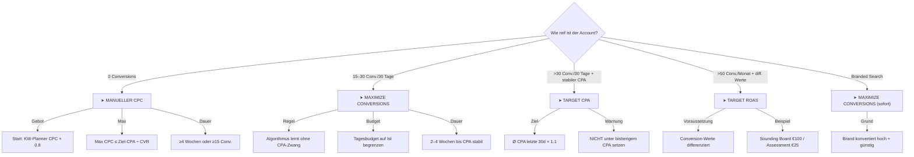

# Bidding-Strategie — Entscheidungsbaum

> Dieses Dokument definiert die Regeln, wann welche Bidding-Strategie eingesetzt wird.
> Der Agent darf KEINE Bidding-Empfehlung aussprechen, ohne diesen Entscheidungsbaum durchlaufen zu haben.

## Entscheidungsbaum



### Bidding-Strategien im Detail

| Account-Reife | Strategie | Start-Konfiguration | Dauer |
|:---|:---|:---|:---|
| 0 Conversions (neu) | **Manueller CPC** | Gebot: KW-Planner × 0.8, Max: Ziel-CPA ÷ CVR | ≥4 Wochen |
| 15–30 Conv./30 Tage | **Maximize Conversions** | Kein Target, Tagesbudget begrenzen | 2–4 Wochen |
| >30 Conv./30 Tage | **Target CPA** | Ziel = Ø CPA × 1.1 (10% Puffer) | Laufend |
| >50 Conv./Monat | **Target ROAS** | Nur bei differenzierten Conversion-Werten | Laufend |
| Branded Search | **Maximize Conversions** | Sofort, kein manueller CPC nötig | Immer |

## Regeln für Bidding-Wechsel

### Wann von Manuell auf Smart Bidding wechseln?
| Bedingung | Erfüllt? |
|:---|:---|
| ≥15 Conversions in den letzten 30 Tagen | ☐ |
| Conversion-Tracking funktioniert korrekt (verifiziert) | ☐ |
| Mindestens 4 Wochen manuelle Daten gesammelt | ☐ |
| Tagesbudget ist nicht limitierender Faktor | ☐ |

**Alle 4 Bedingungen müssen erfüllt sein.** Wenn eine fehlt → Bei manuellem CPC bleiben.

### Wann von Smart Bidding zurück auf Manuell?
- CPA steigt >50% über Ziel für >2 Wochen
- Conversions brechen >60% ein ohne erkennbare externe Ursache
- Budget wird innerhalb der ersten Stunden des Tages verbraucht (Pacing-Problem)

## Budget-Allokation-Formeln

### Mindestbudget pro Kampagne
```
Mindest-Budget/Monat = Ziel-CPA × 30 (Conversions für Smart Bidding)
                     = Ziel-CPA × 10 (absolutes Minimum für Lern-Daten)
```

### Beispiel (x10aix.tech)
| Parameter | Wert |
|:---|:---|
| Geschätzter CPC (DACH B2B) | €3–8 |
| Erwartete Conversion Rate | 3–5% |
| Errechneter Ziel-CPA | €60–267 |
| Mindestbudget für Smart Bidding | €1.800–8.010/Mo |
| Absolutes Minimum für Lerndaten | €600–2.670/Mo |

### Budget-Verteilungsregel
```
Bei Budget X und N Kampagnen:
Wenn X ÷ N < (Ziel-CPA × 10):
    → Reduziere N. Lieber weniger Kampagnen mit ausreichend Budget.
```

## Geo-Targeting-Strategie

| Phase | Geo | Bedingung für nächste Phase |
|:---|:---|:---|
| Phase 1 | Österreich (AT) | Start, Heimatmarkt, bessere Relevanz |
| Phase 2 | + Deutschland (DE) | Nach 8 Wochen, wenn CPA in AT < Ziel |
| Phase 3 | + Schweiz (CH) | Nach Validation in DE, wenn Budget erlaubt |

## Ad Scheduling

| Einstellung | Wert | Begründung |
|:---|:---|:---|
| **Wochentage** | Mo–Fr | B2B-Entscheider suchen werktags |
| **Uhrzeit** | 07:00–19:00 | Kernarbeitszeit DACH |
| **Wochenende** | Aus (Kampagnen 2–4) | Zu wenig B2B-Intent |
| **Ausnahme** | Kampagne 1 (Brand): 24/7 | Markenschutz immer aktiv |
