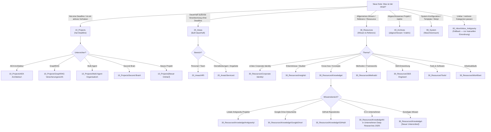

# PARA-Routing — Entscheidungsbaum

> Konsultiere diese Datei in Schritt 2 des obsidian-vault-curator Workflows,
> um den korrekten Vault-Ordner für jede Note zu bestimmen.

## Entscheidungslogik

## Schnell-Referenz Tabelle

| Kriterium | Ordner | Beispiele |
|:---|:---|:---|
| Hat Deadline, aktives Vorhaben | `10_Projects\` | Website Relaunch, Q2 Kampagne |
| Dauerhaft, kein Ende absehbar | `20_Areas\` | HR-Prozesse, Serviceangebote |
| Antigravity Code-Projekt | `30_Resources\Knowledge\Antigravity\` | AG — AEA.md |
| GitHub Repository | `30_Resources\Knowledge\GitHub\` | GH — Skill-Evolution.md |
| Google Drive Dokument | `30_Resources\Knowledge\GoogleDrive\` | Spiegel von G:\ |
| Methode / Framework | `30_Resources\Methods\` | PARA-Methode, EEEE-Zyklus |
| Tool / Software | `30_Resources\Tools\` | Obsidian, NotebookLM |
| Erkenntnisse / Deep Research | `30_Resources\Insights\` | McKinsey KI-Report |
| AI-Chat-Export | `00_Inbox\Inbox_Antigravity\AI-Chats\` | ChatGPT Chat vom 2026-06-01 |
| Abgeschlossenes Projekt | `40_Archives\` | Altes Projekt ohne Aktivität |
| Skript / Template / SOP | `99_System\` | Obsidian SOP, GEM-Bauplan |
| Kategorie unklar | `00_Inbox\Inbox_Antigravity\` | Immer sicher |

## Konfidenz-Schwellenwert

Schreibe nur dann direkt in einen Nicht-Inbox-Ordner, wenn die Konfidenz ≥ 80% ist.
Unterhalb von 80%: Fallback auf `00_Inbox\Inbox_Antigravity\` mit Begründung.

**Konfidenz-Schätzhilfe:**
- Eindeutiger Typ (Code-Projekt, GitHub, AI-Chat) → 95%
- Thema klar, aber 2 Ordner möglich → 60% → Inbox
- Inhalt mehrdeutig oder neues Themengebiet → 40% → Inbox
